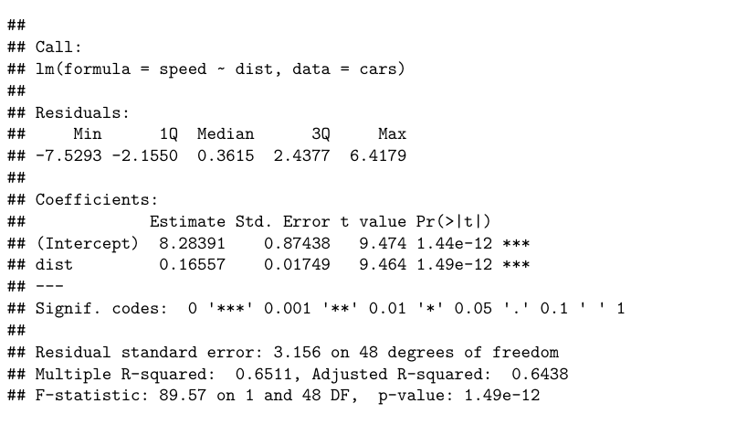

```{r setup, include=FALSE}
knitr::opts_chunk$set(echo = TRUE)
```


\newpage

## Learning goals

What are your learning goals for this course?
My goal for this course is to get a better understanding of what a data scientist does and what tools and statistical techniques do they employ to do it.


\newpage

##  Solution 1

Just run the following:


Model $Y = \theta X+ \epsilon$, where $Y$ is `speed` and $X$ is `dist`. We make there is no output by running the following chunk. 

We attach the image **Practice_assignment_solution1.png** after the `linear-regression` chunk. 


```{r linear-regression, results='hide'}
data(cars)
d <- cars
fit_lm  <- lm(speed ~ dist, data = cars)
summary(fit_lm)
```




\newpage

## Solution 2


Just run the following:

We use the variables that we defined in the [\blc header.tex\bc](header.tex) file.

$\vY = \mX \vbeta + \vep$

\newpage

## Solution 3

Just run the following:

We cite R for Data Science [@wickham2016r]

\newpage

## Solution 4

Just run the following:

We \color{red}highlight a text in color. \color{black} 

We define color commands in [\blc header.tex\bc](header.tex) and use them to \rc highlight a text in color \bc

\newpage

## References
